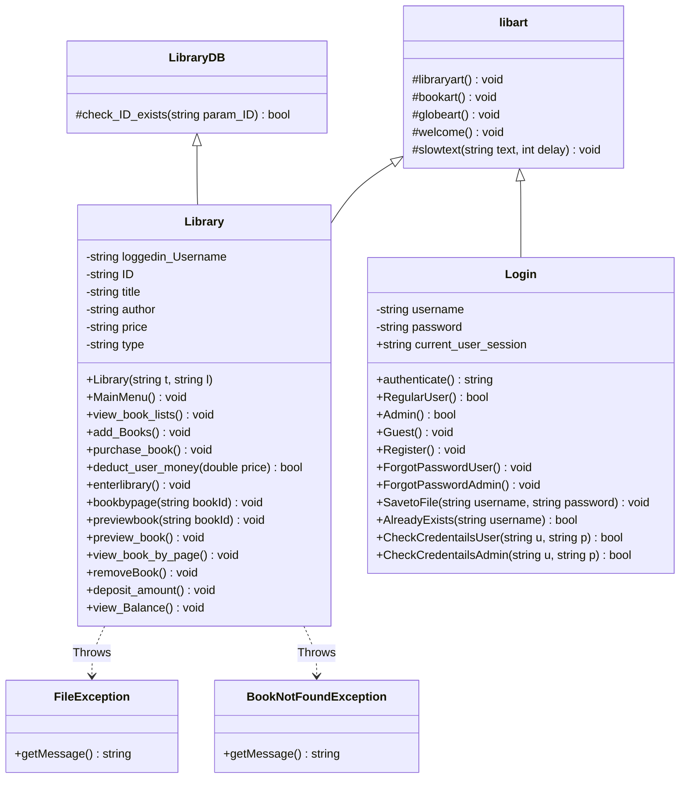

# 📚 Grand Encyclopedia - Advanced Library Management System


> A robust, console-based library application featuring role-based authentication, real-time financial simulation, and persistent file-based database management.

## 📖 Project Overview

The **Grand Encyclopedia** is a C++ application designed to simulate the backend and frontend operations of a digital library. Unlike simple console apps, this project implements a **custom graphical interface** using ASCII art and utilizes **Object-Oriented Programming (OOP)** principles to manage complex user interactions and data persistence.

## 🏗️ System Architecture & Code Explanation

This project relies heavily on C++ OOP concepts. Below is a breakdown of how the code is structured.

### 1. Class Hierarchy (Inheritance)
The system uses **Multiple Inheritance** to separate database logic from UI logic.

* **`LibraryDB` (Backend):** The base class responsible for low-level data validation, such as checking if a Book ID exists in the file stream.
* **`libart` (Frontend):** A dedicated class in `Header.h` that stores all ASCII art, animation delays, and UI helper functions.
* **`Library` (Controller):** The main derived class. It inherits from both `LibraryDB` and `libart`, combining backend data verification with frontend visual elements.



### 2. Data Persistence (File Handling Algorithm)

Since this project does not use SQL, it implements a custom **"Read-Write-Swap"** algorithm to update records (like User Balance or Book Availability) in `.txt` files.

**The Algorithm:**

1. Open the original file (e.g., `Lists.txt`) in **Read Mode**.
2. Open a temporary file (`temp.txt`) in **Write Mode**.
3. Loop through every line of the original file:
* If the line matches the ID/Username to be updated -> **Modify the data** and write to `temp.txt`.
* If the line does not match -> **Copy the data exactly** to `temp.txt`.


4. Close both files.
5. **Remove** the original file and **Rename** `temp.txt` to the original name.

*Code Snippet (from `deduct_user_money`):*

```cpp
while (getline(readFile, tempUsername, ...) ...) {
    if (tempUsername == loggedin_Username) {
        // Calculate new balance and write updated line
        writeFile << tempUsername << "|" << tempPassword << "|" << new_amount << endl;
    } else {
        // Copy existing line
        writeFile << tempUsername << "|" << tempPassword << "|" << tempBalance << endl;
    }
}

```

### 3. Exception Handling

The project avoids standard crashes by implementing custom Exception classes defined in `Header.h`:

* **`FileException`**: Thrown when critical database files (like `Lists.txt`) are missing.
* **`BookNotFoundException`**: Thrown when an Admin tries to remove or a User tries to buy a book ID that doesn't exist.

### 4. User Interface Logic

* **Slow Text Rendering:** The `slowtext()` function uses `std::this_thread::sleep_for` and `std::chrono` to print characters one by one, simulating a retro typing effect.
* **Page-by-Page Reading:** The `bookbypage()` function intelligently parses text files by searching for specific string markers (e.g., "Page 1", "Page 2") to display only the relevant section of a book to the user.

---

## ✨ Application Features

### 🛡️ Role-Based Access

* **Admins:** Full control to add/remove books (`Lists.txt`).
* **Users:** Own a digital wallet. Can deposit funds and buy books. Purchasing checks availability and deducts balance automatically.
* **Guests:** Restricted to "Read-Only" mode (Preview books).

### 📖 content Delivery

* **Previews:** View the table of contents or first chapter.
* **Pagination:** Read full books page-by-page directly in the console.

---

## 🛠️ Installation & Setup

### Prerequisites

* Windows OS (Required for `system("cls")` command).
* Any C++ Compiler (MinGW, Visual Studio, etc.).

---

## 👥 Project Team & Technical Contributions

### **Wajih**
**Role:** System Architect & Integration Lead
* **Core Responsibility:** Spearheaded the debugging of the central application loop and the integration of disparate modules (Login, Library, and Database).
* **Technical Contributions:**
    * Structured the `Library` class inheritance hierarchy, ensuring seamless communication between the backend (`LibraryDB`) and frontend (`libart`).
    * Implemented the administrative logic for `add_Books()` and `removeBook()`, ensuring the database integrity is maintained during file write operations.
    * Managed the global exception handling strategy to prevent system crashes during runtime errors.

### **Ramis**
**Role:** Frontend Developer & Content Systems Engineer
* **Core Responsibility:** Designed the immersive console-based User Interface and developed the core file-reading algorithms for book consumption.
* **Technical Contributions:**
    * Developed the `libart` class in `Header.h`, creating complex ASCII visuals (`libraryart`, `globeart`) and the `slowtext()` animation engine.
    * Engineered the `bookbypage()` algorithm, which parses text files dynamically to display specific content between page markers.
    * Implemented the `preview_book()` functionality to allow secure, read-only access for Guest users.

### **Zohaib Iqbal**
**Role:** Security Specialist & Authentication Engineer
* **Core Responsibility:** Built the robust `Login` class to handle multi-tier user access (Admin, User, Guest) and secure session management.
* **Technical Contributions:**
    * Designed the `authenticate()` logic to route users to specific interfaces based on their credentials.
    * Implemented file-stream logic for `Register()` and `CheckCredentailsUser()` to securely read/write user data to `regular_user_credentials.txt`.
    * Created the "Forgot Password" recovery mechanism (`ForgotPasswordUser`), utilizing a search-and-update file algorithm.

### **Mustafa Imran**
**Role:** Financial Systems Manager
* **Core Responsibility:** Developed the internal economy of the library, managing the digital wallet system and transaction validation.
* **Technical Contributions:**
    * Programmed the `deduct_user_money()` algorithm, which performs real-time balance checks before authorizing purchases.
    * Implemented the `purchase_book()` transaction logic, which simultaneously updates the user's balance and the book's availability status in `Lists.txt`.
    * Created the `deposit_amount()` feature, enabling persistent balance updates across user sessions.
 
---

## 📂 Code Documentation & Function Explanations

### **Class: `LibraryDB` (Backend Database)**

* **`check_ID_exists(ID)`**: Scans the database file to see if a book with the given ID actsually exists.

### **Class: `libart` (Visuals)**

* **`libraryart()`**: Displays the main ASCII art logo for the library.
* **`slowtext(text, delay)`**: Prints text one character at a time to create a "typing" animation effect.
* **`welcome()`**: Displays the globe animation and the "Welcome to Grand Encyclopedia" header.

### **Class: `Library` (Main Logic)**

* **`MainMenu()`**: The central hub that shows options (Add, Buy, View) based on whether the user is an Admin or Regular User.
* **`view_book_lists()`**: Reads the book file and displays all available books in a neat table.
* **`add_Books()`**: *(Admin Only)* Asks for book details and saves a new book to the database file.
* **`purchase_book()`**: *(User Only)* Processes a purchase by checking if the book is available and if the user has enough money.
* **`deduct_user_money(price)`**: A helper function that subtracts the book cost from the user's saved balance in the text file.
* **`enterlibrary()`**: Opens the reading menu where users can read or preview books.
* **`bookbypage(bookId)`**: Reads a specific book file and displays text only between specific page markers (e.g., "Page 1").
* **`preview_book()`**: Shows the "Contents" section of a book file to let users see what it is about.
* **`removeBook()`**: *(Admin Only)* Deletes a specific book from the database by ID.
* **`deposit_amount()`**: *(User Only)* Allows a user to add virtual money to their account balance.
* **`view_Balance()`**: Finds the logged-in user in the file and prints their current money.

### **Class: `Login` (Authentication)**

* **`authenticate()`**: The starting screen that asks if you are an Admin, User, or Guest.
* **`RegularUser()`**: Handles the login process for normal members (checks username/password).
* **`Admin()`**: Handles the login process for administrators.
* **`Register()`**: Creates a new user account and saves it to the credentials file with a default balance.
* **`ForgotPasswordUser()`**: Allows a user to reset their password if they know their username.
* **`CheckCredentailsUser()`**: Verifies if the entered username and password match the records in the file.
* **`AlreadyExists()`**: Checks if a username is already taken during registration.

### **Exceptions**

* **`FileException`**: Triggers an error message if the database files are missing.
* **`BookNotFoundException`**: Triggers an error message if a user tries to access a Book ID that doesn't exist.

### Step-by-Step Guide

1. **Clone the Repo:**
```bash
git clone [https://github.com/Piro369/Grand-Encyclopedia-LMS.git](https://github.com/Piro369/Grand-Encyclopedia-LMS.git)

```


2. **Ensure File Structure:**
Make sure the `Books` folder exists and contains `Lists.txt`.
```text
/Grand-Encyclopedia-LMS
├── main.cpp
├── Header.h
└── Books/
    └── Lists.txt

```


3. **Compile:**
```bash
g++ main.cpp -o library_app

```


4. **Run:**
```bash
./library_app.exe

```


---

## 🧪 Default Login Credentials

To test the system immediately, use these pre-configured accounts:

| Role | Username | Password | Notes |
| --- | --- | --- | --- |
| **Admin** | `admin123` | `123` | Can add/remove books |
| **User** | `wajih` | `123` | Can buy books (Balance: 500) |

---

